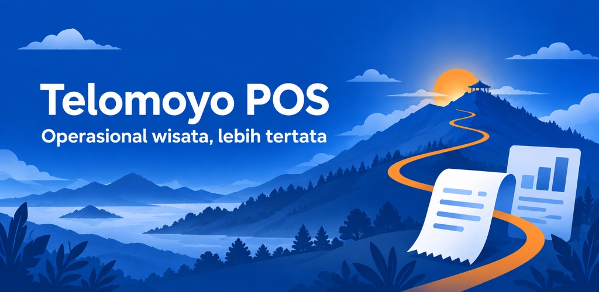

# Telomoyo POS — Google Play Store Listing

Bahasa: Indonesia (`id-ID`). Nama aplikasi: **Telomoyo POS**.

Salin hanya isi blok teks pada Short Description dan Full Description ke Play Console. Catatan produksi dan prompt gambar tidak termasuk teks listing.

## Short Description

72 karakter, termasuk spasi; batas Google Play 80 karakter. [Ketentuan deskripsi Google Play](https://support.google.com/googleplay/android-developer/answer/9859152?hl=id).

```text
Kasir internal Telomoyo untuk transaksi, QRIS, struk, dan laporan bisnis
```

## Full Description

2.296 karakter, termasuk spasi dan baris baru; batas Google Play 4.000 karakter. [Ketentuan deskripsi Google Play](https://support.google.com/googleplay/android-developer/answer/9859152?hl=id).

```text
Telomoyo POS adalah aplikasi kasir internal untuk staf Pengelola Wisata Telomoyo. Kelola transaksi paket, pembayaran, struk, dan laporan dari perangkat Android dalam satu aplikasi.

TRANSAKSI HARIAN
Pilih paket dan jumlah, periksa ringkasan, lalu catat pembayaran tunai atau QRIS. Riwayat transaksi dan koreksi membantu staf meninjau pencatatan sesuai kewenangannya.

QRIS SESUAI NOMINAL
Tampilkan QRIS dengan nominal transaksi dari QRIS merchant yang telah dikonfigurasi untuk unit bisnis. Status pembayaran dikonfirmasi secara manual oleh staf; aplikasi tidak memverifikasi penyelesaian pembayaran secara otomatis.

TETAP MENCATAT SAAT KONEKSI TERPUTUS
Pada perangkat yang sudah disiapkan, transaksi dapat disimpan secara lokal ketika koneksi terputus. Data disinkronkan saat koneksi tersedia. Pusat Sinkron membantu memantau antrean dan menangani data yang memerlukan perhatian. Login, pengaturan tertentu, dan perpindahan bisnis memerlukan internet.

PRATINJAU DAN CETAK STRUK
Tinjau struk sebelum mencetak melalui printer Bluetooth atau printer MPOS terintegrasi yang kompatibel dan telah dikonfigurasi. Pencetakan tersedia setelah pembayaran transaksi dikonfirmasi berhasil. Identitas unit bisnis tercantum pada struk.

DASBOR DAN LAPORAN
Lihat ringkasan operasional, telusuri riwayat dengan pencarian serta filter tanggal atau bulan, dan ekspor laporan per unit bisnis.

BEBERAPA UNIT BISNIS
Beralih di antara unit bisnis aktif menggunakan akun staf yang sama. Paket, transaksi, QRIS, laporan, dan data pengujian tetap terpisah untuk setiap unit bisnis.

DUA PERAN STAF
Admin menjalankan transaksi harian dan menangani koreksi serta konfirmasi pembayaran miliknya. Superadmin juga mengelola paket, staf, unit bisnis, identitas struk, QRIS, dan terminal.

MODE UJI
Jika diaktifkan pengelola, Sandbox menyediakan ruang pengujian terpisah dari laporan produksi, termasuk simulasi atau pengujian cetak dengan penanda khusus. Penting: QRIS dalam Sandbox menggunakan rekening merchant nyata. Pembayaran yang dilakukan tetap memindahkan uang sungguhan sesuai nominal yang ditampilkan.

AKSES INTERNAL
Aplikasi ini memerlukan akun staf dari pengelola dan perangkat yang telah disiapkan. Tidak tersedia pendaftaran akun publik. Kompatibilitas pencetakan bergantung pada model perangkat dan printer.
```

## Feature Graphic

File untuk diunggah: [feature-graphic.jpg](./feature-graphic.jpg).



Spesifikasi: **1024 × 500 piksel**, JPEG RGB, tanpa transparansi. Google Play menerima JPEG atau PNG 24-bit tanpa alfa pada ukuran ini. [Ketentuan feature graphic Google Play](https://support.google.com/googleplay/android-developer/answer/9866151?hl=id).

Alt text (115 karakter):

```text
Telomoyo POS dengan ilustrasi pegunungan biru, jalan jingga, struk, dan laporan: Operasional wisata, lebih tertata.
```

Teks pada gambar:

- Telomoyo POS
- Operasional wisata, lebih tertata

Gambar merupakan ilustrasi merek, bukan screenshot aplikasi. Warna biru `#003D9B` dan aksen jingga `#FF8B00` mengikuti identitas aplikasi; ilustrasi menampilkan pegunungan, jalan, struk, dan laporan. Tidak ada kode QR pembayaran nyata di dalam aset.

### Catatan produksi — jangan disalin ke deskripsi

- Deskripsi menyatakan akses internal, konfirmasi pembayaran manual, kebutuhan internet untuk login/perpindahan bisnis, serta kompatibilitas printer.
- Pembayaran QRIS di Sandbox tetap menggunakan uang sungguhan; keterangan ini sengaja dipertahankan.
- Feature graphic dibuat dengan **built-in image generation**, lalu diekspor ke ukuran JPEG untuk Google Play. Ikon dan aset branding aplikasi yang sudah ada tidak diubah.
- Aset dan teks belum diunggah atau dipublikasikan ke Play Console.
- Persyaratan teknis diperiksa pada 15 September 2026.

<details>
<summary>Prompt final feature graphic</summary>

```text
Use case: ads-marketing
Asset type: Google Play feature graphic for Telomoyo POS, Indonesian locale.
Primary request: Create one finished, polished horizontal store-listing banner. Exact requested canvas: 1024 pixels wide by 500 pixels high, full bleed opaque RGB, no transparent areas. It will promote an internal Android point-of-sale app used by staff of Pengelola Wisata Telomoyo to record transactions, receipts, and reports.
Scene/backdrop: A tasteful, modern layered mountain landscape evoking Telomoyo tourism, integrated with a small abstract paper receipt and a simple report motif. This is editorial brand illustration, NOT an app screenshot. Mountains, winding paths and a small sunrise are the existing brand motifs. Extend those motifs into a new composition rather than showing an oversized duplicate app icon.
Style/medium: Refined flat/paper-cut vector-like raster illustration with restrained depth, clean edges, generous negative space, professional Indonesian tourism operations branding. Crisp white Roboto-style sans-serif typography, high contrast and excellent small-screen legibility.
Color palette: deep royal blue #003D9B dominant, brighter blue #0052CC, light blue #DAE2FF, warm orange #FF8B00 sparingly, white lettering. No dark gray or white-dominant backdrop.
Composition/framing: Balanced wide layout, text in open space and illustration opposite. Keep all words and essential illustration comfortably within the central safe area with at least 70px horizontal and 60px vertical margins on the requested canvas; background can extend to edges. A restrained warm-orange winding path links the mountain landscape with the transaction/receipt metaphor. No device frames, no phone or hardware mockups. Receipt imagery has just a few simple short lines, NOT tiny readable fake UI or financial values.
Text (verbatim, exactly these two phrases, no other text): "Telomoyo POS" as the main headline, and "Operasional wisata, lebih tertata" as a smaller supporting line.
Constraints: No changes to the app name; no Sewa Motor wording; no fake awards, stars, ratings, download counts, price claims, Google Play badges, app store logos, third-party logos, promotional call-to-action, real QR code, people, or watermark. Do not draw a new logo. Do not frame the banner in a phone or page. Deliver the complete opaque landscape banner, not a design mockup.
```

</details>

